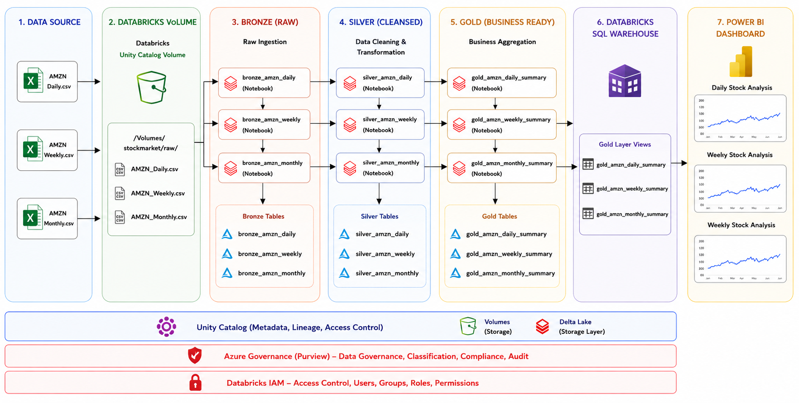

# Stock Market Analytics Pipeline using Databricks and Power BI

## Overview

This project demonstrates an end-to-end Data Engineering pipeline using Databricks Medallion Architecture (Bronze, Silver, Gold) and Power BI.

The pipeline processes Amazon (AMZN) stock market data from CSV files, transforms the data through multiple layers, performs data quality checks, and creates business-ready datasets for reporting and analytics.

---

## Architecture


### Data Flow
Data Source → Databricks Volume → Bronze Layer → Silver Layer → Gold Layer → Databricks SQL Warehouse → Power BI Dashboard
---

## Project Structure
```text
stock-market-analytics
│
├── architecture
│   └── stock_market_pipeline.png
│
├── data
│   ├── AMZN_Daily.csv
│   ├── AMZN_Weekly.csv
│   └── AMZN_Monthly.csv
│
├── notebooks
│   └── xx
│       ├── 1.bronze
│       │   ├── 1.bronze_amzn_daily.py
│       │   ├── 2.bronze_amzn_weekly.py
│       │   └── 3.bronze_amzn_monthly.py
│       │
│       ├── 2.silver
│       │   ├── 1.silver_amzn_daily.py
│       │   ├── 2.silver_amzn_weekly.py
│       │   └── 3.silver_amzn_monthly.py
│       │
│       ├── 3.gold
│       │   ├── 1.gold_amzn_daily_summary.py
│       │   ├── 2.gold_amzn_weekly_summary.py
│       │   └── 3.gold_amzn_monthly_summary.py
│       │
│       └── 4.quality
│           └── data_quality_checks.py
│
├── powerbi
│   └── stockmarket.pbix
│
├── screenshots
│   ├── 1.daily_dashboard.png
│   ├── 2.weekly_dashboard.png
│   └── 3.monthly_dashboard.png
│
├── README.md
└── .gitignore
---

## Data Source

Amazon stock market historical data:

- Daily Stock Data
- Weekly Stock Data
- Monthly Stock Data

Format: CSV

---

## Databricks Volume

Raw CSV files are uploaded and stored inside Databricks Unity Catalog Volume.

Example:
/Volumes/stockmarket/raw/
---

## Bronze Layer (Raw)

Purpose:
Store raw ingested data without modifications.

### Notebooks

- bronze_amzn_daily.py
- bronze_amzn_weekly.py
- bronze_amzn_monthly.py

### Output Tables

- bronze_amzn_daily
- bronze_amzn_weekly
- bronze_amzn_monthly

---

## Silver Layer (Cleaned)

Purpose:
Clean and transform raw data.

### Transformations

- Null value handling
- Data type conversion
- Standardization
- Data validation

### Notebooks

- silver_amzn_daily.py
- silver_amzn_weekly.py
- silver_amzn_monthly.py

### Output Tables

- silver_amzn_daily
- silver_amzn_weekly
- silver_amzn_monthly

---

## Gold Layer (Business Ready)

Purpose:
Create analytics-ready datasets.

### Notebooks

- gold_amzn_daily_summary.py
- gold_amzn_weekly_summary.py
- gold_amzn_monthly_summary.py

### Output Tables

- gold_amzn_daily_summary
- gold_amzn_weekly_summary
- gold_amzn_monthly_summary

---

## Data Quality Checks

Validation checks performed:

- Null Value Check
- Duplicate Check
- Data Type Validation
- Record Count Validation
- Consistency Check
---

## Workflow Orchestration

Databricks Jobs are used to automate execution of:

1. Bronze Layer
2. Silver Layer
3. Gold Layer
4. Data Quality Checks

---

## Databricks SQL Warehouse

Gold layer tables are exposed through Databricks SQL Warehouse for reporting and analytics.

Available Tables:

- gold_amzn_daily_summary
- gold_amzn_weekly_summary
- gold_amzn_monthly_summary

---

## Power BI Dashboard

Three dashboards were created:

### Daily Stock Analysis

Features:

- Highest Price
- Lowest Price
- Total Volume
- Average Close Price Trend

### Weekly Stock Analysis

Features:

- Weekly Average Close
- Weekly Highest Price
- Weekly Lowest Price
- Weekly Trading Volume

### Monthly Stock Analysis

Features:

- Monthly Average Close
- Monthly Highest Price
- Monthly Lowest Price
- Monthly Volume Trend

---

## Screenshots

Add screenshots inside the screenshots folder:

screenshots/
├── daily_dashboard.png
├── weekly_dashboard.png
└── monthly_dashboard.png
---

## Technologies Used

- Databricks
- Apache Spark
- Delta Lake
- Databricks SQL Warehouse
- Power BI
- Python
- SQL

---

